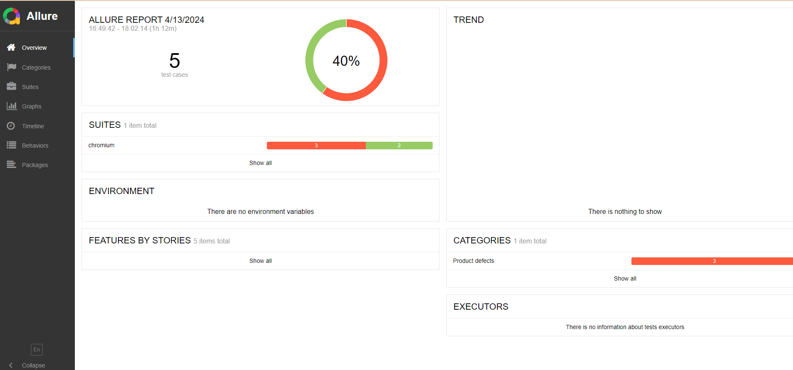

# Hi, I'm Amr Moussa 👋

  

  

I’m a passionate self-taught Software Testing Professional from Cairo, Egypt.  
I’m an open-source enthusiast and maintainer, and have learned a lot from the open-source community. I love to share my experience and learnings through blogs. I’m working towards giving back to the community what I have learned from it.

---

➡️ Check out my website: [https://linktr.ee/Amr_kaza](https://linktr.ee/Amr_kaza)

💼 For freelance work or paid training on Software Testing / Test Automation: <mailto:amro_kaza@hotmail.com>

💬 Ask me about anything related to Software Testing / Test Automation — I’ll be happy to help!

---

  <!-- Social / contact badges -->
  
  
  
  

---

## 📊 Profile stats

  <!-- GitHub stats (replace username if different) -->
  
  &nbsp;&nbsp;
  

---

If you like my work, please consider buying me a tea/coffee:  
[Buy Me A Coffee](https://www.buymeacoffee.com/)

---

✨ Project #10 ✨  —  Project Date: April 14, 2024  
Repository / course: Playwright-JS-Automation-Testing-from-Scratch-with-Framework

Features
- Understand Web Automation with Playwright on live applications
- Comprehensive coverage of Playwright methods with examples
- Making API calls within UI automation tests for smarter automation
- Intercept network/API requests & responses with Playwright
- Learn Playwright Inspector tool, Trace Viewer & CodeGen (record/playback)
- Develop end-to-end framework using Playwright features
- Visual testing (image comparison) with Playwright
- JavaScript fundamentals required for Playwright automation
- Page Object Model (POM) design pattern
- Cucumber integration for BDD approach
- HTML & Allure reporting integration with CI (Jenkins)
- Data-driven testing for parameterization

  <!-- Project image placeholder -->
  

---

---

## 📫 Contact
- Email: amro_kaza@hotmail.com
- Linktree: https://linktr.ee/Amr_kaza
- GitHub: https://github.com/Amromoussa2211

✨ Project #10 ✨ 📅 Project Date: April 14, 2024

Features 

✨ Understand the Web Automation with Playwright on Live Applications 

✨ Comprehensive knowledge on all Playwright Methods and their usage with examples 

✨ Learn How to make API calls with in UI Automation tests to perform smart automation 

✨ Understand how to Intercept Network/API requests & responses with Playwright 

✨ Get Familiar with Playwright Inspector tool, Trace Viewer & Code Gen (Record Playback) tools 

✨ Develop End to end Framework with Playwright utilizing all the features available in the tool 

✨ Learn Visual testing with Playwright to compare the Images 

✨ Learn JavaScript fundamentals required for Playwright Automation testing 

✨ Web Automation with Playwright 

✨ API calls within UI Automation tests 

✨ Inspector tool, Trace Viewer & Codev 

✨ Visual testing with Playwright 

✨ Page object model Design pattern 

✨ Cucumber integration for BDD approach 

✨ HTML and Allure reporting integration with Jenkins 

✨ Data-driven for parameterizing playwright

